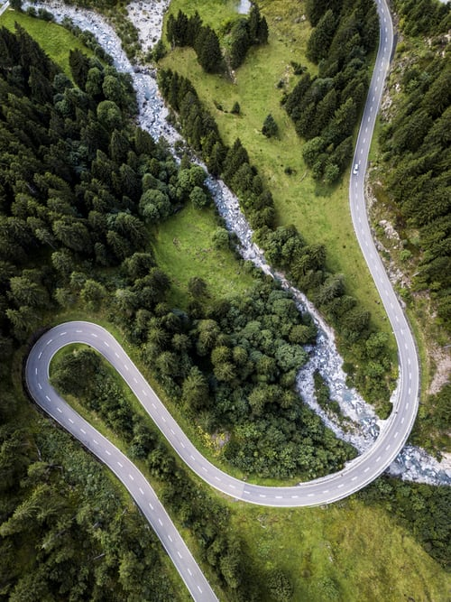

**This is pretty basic.** I created this website from scratch to practice front-end development. After following a lot of devs on twitter and on YouTube, the consensus was that to really learn, I had to create my own project.

I was just watching other people on YouTube and copying their projects. [Thanks Brad Traversy!](https://www.youtube.com/channel/UC29ju8bIPH5as8OGnQzwJyA) To be fair, I did pick up a lot of skill this way. It’s a great way to get started when you don’t know anything, but as time progressed, I got stuck in the dreaded “tutorial hell.” I struggled to create my own projects.

But that it was where true learning lies - in the struggle. So far, I’ve fought with how to make this site responsive. I used a viewport height property on a section which looks fine on a laptop display but when you resize it, it gets wonky. I must come up with another solution.

For now, I decided to focus on styling this blog post format. I’m going to keep it a simple as possible. There’s a fine line between getting out of the comfort zone and overwhelming myself with tasks I’m not ready for.

Other things: My random road image is to mark the phase of life I’m in. It’s a wanderlust, road less-travel phase which I had thought about blogging about, but I am puttin it on the back burner.

Next thing to attempt: Figure out a way to automate blog post entries formats with a content management system. Brad has a tutorial on this. He’s awesome. You should check him out if you like this stuff too.

Dream: To get a second form of income working in tech in some small way remotely, so I can satisfy my wanderlust.

Desire: To rightly align the gifts and talents bestowed upon me with God’s will and maximize them for His Kingdom.
